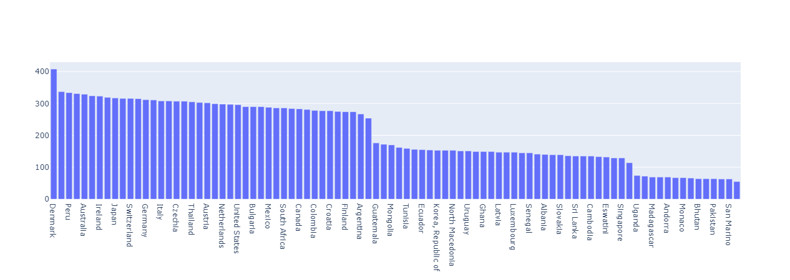
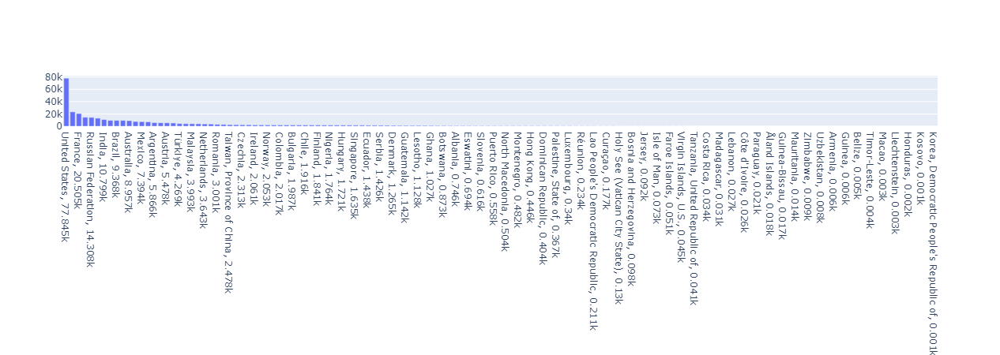
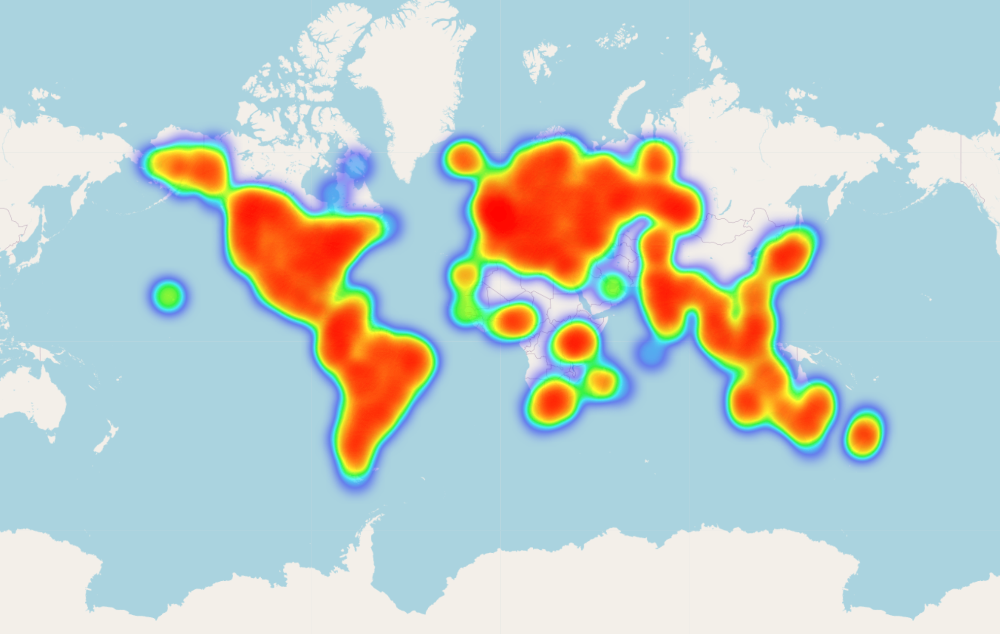
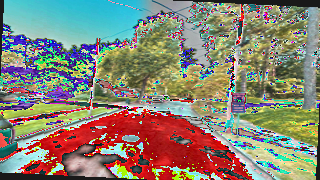
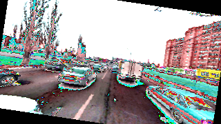
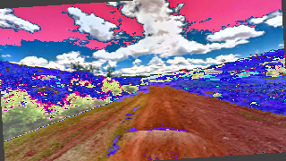
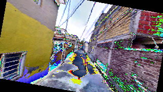
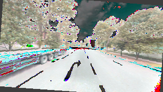

# Introduction

## Group Members

[Linus Schlumberger](https://gitlab.com/Killusions)  
[Lukas Stöckli](https://gitlab.com/Valairaa)  
[Yutaro Sigrist](https://gitlab.com/yusigrist)

## Problem description

Nowadays, images are often automatically enriched with various data from different sensors within devices, including location metadata. However, this metadata often gets lost when images are sent through multiple applications or when devices are set not to track locations for privacy reasons. As a result, images may initially have metadata, but it is lost when shared with friends or published online. This raises the question: Is it possible to re-enrich these images with their location after the metadata is lost?

The main goal of this project is to determine if an Image Classification Model can outperform humans in guessing the countries or regions of images based solely on images with low resolution and no additional information.

### Project Overview

This project explores the development of an Image Classification model, focusing on simple street-view images grouped by locations to predict the country or region where an image was taken. Given our limited prior experience with Image Classification, this initiative aims to enhance our understanding and skills in this domain. The first objective is to create a model capable of identifying the country from a given image. Building upon this, a second model will be developed to predict the exact region of the image, providing a more precise location than just the country.

The main goal is to develop a robust Image Classification model that can serve as a foundational tool for various applications. This overarching objective supports the specific sub-goals of predicting the country and coordinates of an image. This leads to the question: for what main purposes could an image classifier for countries or coordinates be valuable? We explored several potential applications to show the broader utility of the developed models in real-world scenarios.

### Potential Applications

- **Helping find missing persons**: Our solution can help find where a missing person might be by analyzing publicly shared images. The emotional impact of helping reunite families or providing important clues is considerable. Especially when the model will be used to aid the search process of the police. For missing persons, every second counts in cases of human trafficking, especially when the search is international.
- **Rediscovering memories and family history**: Have you ever come across an old image of someone close to you? Maybe of a deceased family member or of someone who might just not remember where it was taken. Our model can try to predict the rough location to help you rediscover your past.
- **Supporting humanitarian action:** In disaster situations, our model could help to quickly identify the most affected areas by analyzing current images from social media or aid organizations. This would improve the coordination of rescue and relief efforts and offer insights and support to those impacted and the ones closest to them.
- **Discovering new travel destinations:** Have you ever encountered stunning images of places on social media platforms and wondered where they were taken? Our image classifier can help you with that. By analyzing the image, our classifier can identify the location and provide you with the information you need to plan your next trip. This way, you can discover new and exciting travel destinations that you may never have known about otherwise.
- **Classification as a service**: With our model, we can help other companies and data science projects label their data. This is why we would like to offer it as a service, for easy integration. Sometimes companies may want to block, permit, or deploy individual versions of their applications in different countries. Some countries are more restrictive when deploying certain applications, therefore an image predictor can help companies deploy the right version on the right devices in these countries.

## Literature Review

### State of the Art

Recent advancements in deep learning have significantly enhanced the ability to determine the geographical location of an image. DeepGeo, developed by Suresh et al., leverages visual cues such as vegetation and man-made structures like roads and signage to infer locations. This approach aims to replicate the human ability to use environmental indicators and prior knowledge for geolocation [@suresh2016deepgeo]. The DeepGeo model restricts its scope to the United States, utilizing panoramic viewpoints to classify images based on their state. Each input sample consists of four images taken at the same location, oriented in cardinal directions, which are then classified into one of 50 state labels [@suresh2016deepgeo].

In contrast, PlaNet, developed by Weyand et al., tackles global image geolocation. It employs a deep convolutional neural network based on the Inception architecture, trained on 126 million geotagged photos from Flickr. PlaNet's method involves partitioning the world map into multi-scale geographic cells and classifying test images into these cells. Despite its large dataset and extensive training, PlaNet achieves a country-level accuracy of only 30% on its test set [@weyand2018planet].

M2GPS, developed by Hays and Efros, is another significant baseline in scalable image geolocation. This model performs data-driven localization by computing the closest match via scene matching with a large corpus of 6 million geotagged Flickr images, utilizing features such as color and geometric information. IM2GPS's approach demonstrates the importance of leveraging large datasets for effective geolocation [@hays2008im2gps]​​.

Banerjee’s work emphasizes the classification task of predicting image location solely based on pixel data. Their research highlights the use of CNNs and transfer learning to achieve high-accuracy models capable of superhuman performance. CNNs are particularly effective due to their ability to capture low-level and complex spatial patterns [@banerjee2023image].

Dayton et al. explored a similar task by using a ResNet-50 CNN pre-trained on ImageNet for classifying street view images from the game GeoGuessr. Their model utilized transfer learning to refine the pre-trained network on a dataset specifically curated for the task, resizing images to 224x224 pixels for input. By fine-tuning the last layers of ResNet-50, they achieved a test accuracy of over 70% for 20 different countries, highlighting the efficacy of leveraging pre-trained models for geolocation tasks [@dayton2023cnn].

Another notable model is PIGEON, which combines semantic geocell creation with multi-task contrastive pretraining and a novel loss function. PIGEON is trained on, among others, GeoGuessr data and demonstrates the capability to place over 40% of its guesses within 25 kilometers of the target location globally, which is remarkable. This model highlights the importance of using diverse datasets and innovative training techniques to enhance geolocation accuracy [@haas2024pigeon].

While these models exhibit high accuracy in controlled conditions, they often rely on high-resolution images, multiple perspectives, and enriched datasets that do not reflect real-world scenarios. For instance, DeepGeo's use of panoramic images and PlaNet's extensive dataset of geotagged Flickr photos introduce biases towards urban areas and well-known landmarks, limiting their effectiveness in arbitrary or rural locations [@suresh2016deepgeo]. Additionally, these models struggle to generalize to lower-resolution images and more diverse datasets that include unseen locations, as highlighted by the performance discrepancies observed in models like PIGEON when applied to varied datasets [@haas2024pigeon].

Furthermore, Banerjee’s research on digital image classification since the 1970s underscores the evolution from using textural and color features to the current reliance on CNNs. This historical perspective reveals that early models had limited discriminative power and robustness, which were significantly improved with the advent of SIFT (Scale-invariant feature transform) and visual Bag-of-Words models. However, the transition to CNNs marked a pivotal shift due to their superior ability to capture both low-level and high-level features [@banerjee2023image].

Dayton et al. further illustrate the application of transfer learning in geolocation by refining a pre-trained ResNet-50 model on a specific geolocation task. Their work highlights the importance of data augmentation and hyperparameter tuning in improving model performance, as well as the need for balanced datasets to reduce bias and enhance generalizability [@dayton2023cnn].

To develop more robust and universally applicable geolocation models, it is essential to focus on creating systems that can operate effectively with lower-resolution images and without the need for panoramic views or extensive enriched datasets. This involves training models on diverse, real-world datasets that include a variety of image types, from urban streets to rural landscapes, captured under different conditions and perspectives. By doing so, the models can better mimic the conditions under which humans typically geolocate images, such as in social media posts, emergencies, and historical photo analysis. For instance, PIGEOTTO, an evolution of PIGEON, takes a single image per location and is trained on a larger, highly diverse dataset of over 4 million photos from Flickr and Wikipedia, excluding Street View data. This approach demonstrates the model's ability to generalize to unseen places and perform well in realistic scenarios without the need for multiple images per location [@haas2024pigeon].

### Recent Breakthroughs in CNN Architectures

#### ResNet: Addressing the Degradation Problem in Deep Networks

The introduction of deep residual learning by He et al. (2015) marked a significant milestone in the development of convolutional neural networks (CNNs). Their work addressed the degradation problem in deep neural networks by proposing a residual learning framework that allows layers to learn residual connections to partly conserve the layer inputs. This architecture, known as ResNet, employs shortcut connections that perform identity mapping, which are then added to the outputs of the stacked layers [@he2015deep]. This innovative approach mitigates the vanishing gradient problem and therefore enables the training of extremely deep networks with more than 100 layers, achieving superior performance in image classification tasks.

#### MobileNetV2: Inverted Residuals and Linear Bottlenecks

Designed specifically for mobile and resource-constrained environments, MobileNetV2 introduced by Sandler et al. (2019) represents a significant advancement in efficient CNN architectures. The core innovation of MobileNetV2 is the inverted residual linear bottleneck layer module, which significantly reduces the memory footprint and computational cost during inference without sacrificing accuracy [@sandler2019mobilenetv2]. This is achieved through a low-dimensional compressed representation that is expanded and then filtered with a lightweight depthwise convolution before being projected back to a low-dimensional representation.

#### EfficientNet: Rethinking Model Scaling for CNN's

EfficientNet, proposed by Tan and Le (2020), introduces a new model scaling method that uniformly scales all dimensions of depth, width, and resolution using a simple yet highly effective compound scaling method. This balanced scaling approach enables EfficientNet to achieve superior performance while being much smaller and faster than previous models [@tan2020efficientnet]. For instance, EfficientNet-B7 achieves state-of-the-art 84.3% top-1 accuracy on ImageNet, being 8.4x smaller and 6.1x faster on inference compared to traditional CNN architectures [@tan2020efficientnet].

## Contributions

This paper has four main contributions. Firstly, we are publishing our code for efficient training, distribution, and evaluation as a GitHub repository, which also includes the code for our data collection process [@killusions2024lostAndfound]. Additionally, we are publishing our collected dataset, the largest public dataset of its kind [@killusions2024StreetLocationImages]. Secondly, we address the limitations of current geolocation models by developing a novel approach that leverages low-resolution images, enabling accurate geolocation in more realistic and diverse scenarios. Thirdly, we enhance the dataset by expanding it to include more countries, ensuring a balanced and distributed representation, which is crucial for mitigating biases present in state-of-the-art models. Lastly, we tackle hardware limitations by optimizing image sizes, making the model more accessible and efficient for deployment on various hardware platforms.

Our contributions make the task of image geolocation more accessible, making it more practical and effective for a wide range of applications and enabling future improvements. By addressing these key challenges, we believe our work will pave the way for the development of more robust and universally applicable geolocation technologies.

# Methods

## Data collection

### Data source

When it comes to relatively uniform street imagery, there are not many sources. [Google Street View](https://www.google.com/intl/en/streetview/) being by far the biggest. But instead of sourcing our images directly from Google, we wanted to have a more representative distribution, as well as a more interactive demonstration.

For this reason, we instead opted for the online geography game called [GeoGuessr](https://www.geoguessr.com/). This has the advantage of not manually having to source where there is coverage, at what density, and decide on a distribution. The game revolves around being “dropped” into a random location on Google Street View, and having to guess where it is located.

Originally the player is allowed to move around, but there are modified modes to create a higher difficulty level, which prevent the moving or even the panning of the camera, which is what we'll be opting for. This will also allow it to generalize more to other static pictures than if we were using the 360° spheres.

Because different countries are of different sizes, but also have different amounts of Google Street View coverage, deciding on a representative distribution for generalization would be very difficult. Instead, we opted to play the GeoGuessr multiplayer game mode called "Battle Royale: Countries". This game mode revolves around trying to guess the country of a location before the opponents do. It has a much more even distribution of countries, while still taking into account the densities of different places.

_Figure 1: Graph of all countries of the multiplayer dataset, 2024_

Unfortunately, data collection using a multiplayer game mode is quite slow, as even though we do not need to guess and can spectate the rest of the game, we still need to wait for the other players to guess every round. The number of concurrent games was also limited by the number of currently active players. Additionally, while spectating it is not easily possible to get the exact coordinates of a location, restricting us to only predicting the correct countries. Lastly, we were detected by their anti-cheating software as the automation environment is injecting scripts into the website.

Instead, we chose to collect data through the most popular singleplayer game mode called "World" ("Classic Maps"), by putting in arbitrary guesses and playing a lot of rounds. This allowed us to collect data a lot quicker, as well as also collecting the coordinates, however, it came at the cost of a very skewed distribution.

_Figure 2: Graph of all countries of the singleplayer dataset, 2024_

To remedy this, we instead use the country distribution of our multiplayer games and apply it to our collected singleplayer data. This leaves a lot of data unused and forces us to remove very rare countries, but it allows us to get to the required amount of data a lot quicker.

### Web scraping

To collect this data, we built our own scraper, utilizing the testing and browser automation framework ["Playwright"](https://playwright.dev/). We then deployed 5 parallel instances of this script to a server and periodically retrieved the newly collected data.

Our script starts by logging in and storing the cookies for further sessions, it then accepts the cookie conditions and attempts to start a game. We do this by navigating the page using the text, as there are no stable identifiers. For multiplayer, it additionally checks for rate-limiting or if it joined the same game as another instance of the script, in those cases it waits for a certain amount of time and attempts the same again.

After a game starts it will wait for a round to start, wait for the image to load, hide all other elements on the page, move the mouse cursor out of the way, and take a screenshot. For singleplayer, it then guesses a random location, while in multiplayer it waits for the round to end, spectating the rest of the game afterward. At the end of each round, the coordinates or in the case of multiplayer the country are read from the page and saved to a file. Both of these files are named after the "game id", which we extract from the URL, preventing duplicates. This is then repeated until the script is stopped.

Initially, we had a lot of issues with stability, especially with our parallelized workers. After we got rid of hardware bottlenecks, we also looked to eliminate as many fixed waits as possible, replacing them with dynamic ones to avoid timing issues. Finally, we made sure to enable auto-restarting and added a lot of other measures to completely restart after our environment stops working, which can happen during extended scraping sessions due to memory limitations. We then let this script run in parallel, non-stop, for multiple weeks, collecting 18,582 multiplayer data points and 356,606 singleplayer data points.

To make sure our data is collected correctly, we manually inspected it periodically. Any faults we noticed in the images, like black screens and blurring, we would address later in our filtering. However, we also had to inspect whether the coordinates and countries were accurate.

Regarding the legal aspects, in the [Terms of Service of GeoGuessr](https://www.geoguessr.com/terms) web scraping is never explicitly forbidden, so we went forward with the assumption of it being allowed, especially since they did not seem to crack down on our activity. We, however, do not advise or endorse the use of our data collection code for large-scale, commercial, or legally dubious activity.

## Data analysis

As mentioned before under “Data source” and described in detail below under “Mapping to a distribution”, we map our data according to the occurrences of countries in the multiplayer data. Because of this, we started looking at our country distributions quite early.

_Figure 3: Graph of all countries of the SINGLEPLAYER dataset, 2024_

The singleplayer data country distribution is heavily skewed, consisting mostly of pictures of the United States and a few other overrepresented countries. We knew that this would hamper performance and that a lot of the smallest countries would not have sufficient data for training.
However, we also saw a chance to be able to predict a lot of mid-sized countries and smaller countries. Interestingly, it also includes a lot of locations that would normally not be expected to have Google Street View coverage, like very small island nations and even North Korea. This is due to the data not only including official Street View imagery but also user-submitted photospheres.

_Figure 4: Image of sample places, 2024_

After sampling a couple of images, we not only realized that predicting the country would be a lot harder than we initially anticipated, wondering ourselves about which labels belonged to which images. We also realized that some images are very dark, low resolution, or blurry, especially the aforementioned photospheres, which we decided to filter before training.

Additionally, when we were mapping our country distribution from multiplayer to singleplayer, we noticed that despite having significantly more data points, and countries, and them even being present in incredibly remote locations, there was one country present in multiplayer data that was entirely missing from the singleplayer one.

To investigate if this was a labeling issue, we decided to generate an interactive map, allowing us to see where exactly all our locations are located. And this confirmed that we did indeed not have any singleplayer data in Bermuda. Unfortunately, we can only speculate about the reasons for this one-sided omission.

_Figure 5: Heatmap of the distribution around the world, 2024_

## Data processing

### Resizing of the images

We can't train the classifier using images in a high resolution, because our resources are limited, and often images (like of missing persons) can be of a very low quality. So we decided to reduce the resolution, at the beginning of the processing, to about 1/4 of the original resolution of 1280p × 720p. This also helps to move the images for learning to a server for easy distribution and deployment and reduces processing time for future steps.

### Country Enriching

In our project, we focused on collecting images from GeoGuessr in singleplayer mode to ensure we obtained locations with precise coordinates. In contrast, images collected in multiplayer mode mostly only provide the country name without the exact coordinates. Additionally, we faced a ban from multiplayer mode due to webpage injections, which triggered GeoGuessr's automated anti-cheating system.

Our objective is to explore different approaches using low-resolution images to evaluate their effectiveness in predicting coordinates, regions, and countries. For this purpose, we require all three types of information for each image, enabling us to train models with accurate predictions. Throughout the process, we encountered various challenges. Reverse geocoding allowed us to derive country information from coordinates, but the "pycountry" module did not always provide comprehensive location data. For example, Kosovo is not officially recognized by pycountry, necessitating its manual addition to our country list. This adjustment was crucial since GeoGuessr included pictures from Kosovo, which was not covered by the "reverse_geocoder" and "pycountry" modules.

We also faced difficulties mapping the correct country to the provided data when names were derived from multiplayer mode. To address this, we used a fuzzy matching algorithm to find the best match for a sample based on the given country name, ensuring accurate country assignment.

To enhance the efficiency of processing our large dataset, we employed multiple workers to handle the data concurrently. This approach significantly improved the processing speed.

### Region Enriching (Source, Mapping)

To get the region of our image samples, we first searched for a list of regions around the world. And decide to use [a data source file from Natural Earth](https://www.naturalearthdata.com/downloads/110m-cultural-vectors/#:~:text=Issues%20%7C%20Version%20History%20%C2%BB-,Admin,-1%20%E2%80%93%20States%2C%20Provinces), which we then converted to GeoJSON for ease of use.
For each region, we had a list of coordinates, which mark the border of the region, but for our predictions, we had to get the middle point of each one. This is where the Python library "geopandas" comes in handy.
This library has the advantage of being able to work with GeoJSON files and having an integrated middle point calculation function. In addition, we add a unique region_name for each region using the country name + name of the region + id. This is needed since some of the regions have similar or the same name.
After this preparation, we used the middle point to get the region for each image using their coordinates and the k-nearest-neighbor method.

### Mapping to a distribution

As mentioned in the previous section [Web scraping](#Web%20scraping), our singleplayer data is skewed towards a few countries, with some countries only appearing very rarely. To address this, we are mapping our singleplayer data to the country distribution of our multiplayer data. This allows us to have a better distribution while still not having every country appear with the same frequency to account for size and coverage differences. It, however, comes with the downside of not being able to use all of our data.

Unfortunately, this also doesn't allow us to include all countries as some of them do not appear often enough and would reduce the number of images we are allowed to use for other countries as well. To achieve a mapping including enough files while including as many countries as possible, we set a minimum threshold of how often a country has to appear within the singleplayer data (0.75% of the total). Because this included too few countries, we added a slack factor (0.75), allowing countries that could almost meet the distribution to be included as well.

Finally, we saved this as a list of file names using our "data-loader", and committed it to our repository, making our runs reproducible. We created a few different variants of the mapped list, sometimes including more countries and other times more files per country, until we found a good balance.

### Filtering of data

To address issues with our scraping's inherently unstable nature, as well as the big variety of Google Street View images, we had to do some automated filtering of unsuitable data. This consisted of both filtering our images, but also the corresponding data. After filtering we again saved this as a list of file names using our "data-loader", and committed it to our repository.

To filter images we started by setting a minimum threshold of the biggest variance of color between the pixels of an image, meaning either red, green, or blue has to vary by some amount. This easily filters out black screens and dark images, like the ones indoors or inside tunnels. Additionally, we added a threshold for the variance after the laplacian kernel was applied, allowing us to filter some blurry and low-quality images. We set our thresholds after doing manual sampling and some test runs.

_Figure 6: Image of places with the variances, 2024_

Additionally, we realized that some rounds were in the exact same locations, so we decided to filter out duplicates by comparing their coordinates, only keeping the first occurrence. This, as well as the image filtering, comes with the added benefit of filtering corrupted data, which would otherwise have to be handled in our training code.

## Prediction approaches

### Predicting Coordinates: Mean Squared Error

The initial approach we took was to predict the exact coordinates of a location. We initially believed this would be easier since coordinate prediction is a basic method. To remove biases and scaling difficulties, we decided to project our coordinates into a cartesian (x,y,z) system for prediction. However, after a few training iterations, we realized this approach was more challenging than predicting countries or regions due to several issues.

The first problem was the distribution of our dataset compared to the actual distribution of locations on Earth. From GeoGuessr, we collected 81,505 mapped images, with a fairly even distribution after filtering, and a total of 332,786 images without checked distribution. Despite our efforts to ensure even distribution, the dataset was not uniformly spread across the globe. This imbalance meant that incorrect model predictions often resulted in large geographical errors, increasing the loss significantly.

We observed that while the network performed well on the training set for the first 10 epochs, the validation accuracy for distance was poor. The model struggled to predict the correct continent in the validation set, resulting in a high mean loss. We used Mean Squared Error (MSE) and the spherical distance to calculate the loss, as explained in the "Regions with Custom Loss" subsection. Although we had a mean distance metric, it was unclear why and where exactly the model was making incorrect predictions.

To address this issue, we shifted our focus to the other two approaches: predicting countries and predicting regions. Predicting countries is a classification problem, making it more straightforward. When predicting regions, we can also map our regions to their corresponding countries, allowing for better comparison of results. This fine-grained approach helps us understand which country or region the model believes the image was taken in, making it easier to identify why and where the model makes incorrect predictions and how far off these predictions are from the actual locations.

### Predicting Countries: Categorical Cross-Entropy

For predicting the countries, we use a simple Cross-Entropy loss. This method is well-suited for our classification problem, as it measures how well a predicted probability distribution matches the actual distribution (or ground truth) of class labels.

First, we create a unique mapping list for each dataset, assigning each country an index. We then map the countries from their labels to their indices in every split of the dataset, making sure they share the same indices.

We save this information to Weights and Biases (Wandb) for each run to ensure the mappings are consistent when testing or deploying the corresponding model. The loss is calculated using the following formula:

$$
L = -\frac{1}{N} \sum_{i=1}^{N} \log \left( \frac{e^{x_{i, y_i}}}{\sum_{j} e^{x_{i,j}}} \right)
$$

where:

- $L$ is the categorical cross-entropy loss.
- $N$ is the number of samples.
- $x_{i,j}$ is the predicted score/logit for class $j$ for sample $i$.
- $y_i$ is the true class label for the sample $i$.

By implementing this proven method, we ensure that our model's predictions are evaluated accurately, providing us with a reliable metric to improve our classification models without questioning our loss function.

### Predicting Regions: Custom Haversine smooth loss

For the region prediction, we use a custom loss function. This, in short, is a loss function which doesn't only check if the correct region is predicted or with which probability, but it considers also the distance to the correct region. This means if the predicted region is only slightly off then the loss is not as big as when it is far off.
For this loss function we referenced the paper “PIGEON: Predicting Image Geolocations” from Stanford University[@haas2024pigeon], since they not only are using the same loss function but also published their implementation.

##### The steps of the custom loss function

The Haversine distance is a measure of the shortest distance between two points on the surface of a sphere, given their longitudes and latitudes. It is calculated using the following formula:

$$
\text{Hav}(\mathbf{p_1}, \mathbf{p_2}) = 2r \arcsin \left( \sqrt{\sin^2 \left( \frac{\phi_2 - \phi_1}{2} \right) + \cos(\phi_1) \cos(\phi_2) \sin^2 \left( \frac{\lambda_2 - \lambda_1}{2} \right)} \right)
$$

where:

- $r$ is the radius of the Earth (6371 km in this implementation),
- $\mathbf{p_1}, \mathbf{p_2}$ are the 2 points with longitude $\lambda$ and latitude $\phi$

The smoothed labels are calculated using the following formula:

$$
y_{n,i} = \exp \left( - \frac{\text{Hav}(\mathbf{g_i}, \mathbf{x_n}) - \text{Hav}(\mathbf{g_n}, \mathbf{x_n})}{\tau} \right)
$$

where

- $\mathbf{g_i}$​ are the centroid coordinates of the geocell polygon of cell $\mathbf{i}$
- $\mathbf{g_n}$​ are the centroid coordinates of the true geocell.
- $\mathbf{x_n}$​ are the true coordinates of the example.
- $\tau$ is a temperature parameter.

Finally, the cross-entropy loss is calculated between the model outputs and the smoothed labels.

## Model architectures

To develop a robust and efficient image classification model for predicting the geographical origin of low-resolution images, we employ several state-of-the-art convolutional neural network (CNN) architectures. These architectures, known for their advanced design and high performance in image recognition tasks, are utilized in our training to ensure optimal results, as detailed in the Literature Review above. We specifically focus on ResNet, MobileNetV2, and EfficientNet architectures, each offering unique advantages for our project. These each bring their own advancements and advantages, as described above in [Recent Breakthroughs in CNN Architectures](#Recent%20Breakthroughs%20in%20CNN%20Architectures). Especially interesting are MobileNetV2 and EfficientNet, as they are relatively efficient for their size, while ResNet50 can still serve as a good baseline.

By leveraging these advanced CNN architectures, using their pre-trained weights, and fine-tuning them on our custom dataset, we aim to develop a well-performing, efficient model capable of accurately predicting the geographical origin of images with minimal hardware resources.

## Training and Fine-Tuning

For our project, we use the following models from selected architectures:

- **ResNet**: ResNet18, ResNet34, ResNet50, ResNet101, ResNet152
- **MobileNet**: MobileNetV2, MobileNetV3 Small, MobileNetV3 Large
- **EfficientNet**: EfficientNet-B1, EfficientNet-B3, EfficientNet-B4, EfficientNet-B7

To be resource-efficient and enable training the CNN architectures with affordable hardware, we decided to use pre-trained weights and replace their respective classification layers with a custom classification layer that uses the countries or regions of our dataset as classes. For the training, we reduce the learning rate for the layers with the pre-trained weights by a factor of 10, allowing the network to focus more on training the new classification layer with randomly initialized weights while fine-tuning the existing layers with pre-trained weights. The pre-trained weights we use are the default weights from the torch models, IMAGENET1K_V1 and IMAGENET1K_V2, which we loaded and used throughout our project.

Additionally, we considered integrating all possible countries into the models for the final classification layer to make the models more adaptable for multiple tasks and other datasets. This approach could facilitate further training with more data, including more countries, at a later stage. However, we decided against this to help the network perform better with the existing classes of our dataset. Including too many classes would introduce additional complexity and hinder the performance of our models.

## Data augmentation

Data augmentation is crucial for computer vision tasks, especially when using CNN networks. While CNNs are very powerful in identifying objects and patterns, they struggle with variations in rotation, perspective, or view. To address this, it is essential to augment the training data to make the model more robust to different image transformations. This prepares the model to recognize identical objects from different angles or if they are stretched or squeezed. For our GeoGuessr images, data augmentation is particularly important. The images are consistently taken by a Google car with the same height and camera settings. This consistency helps the model learn from a uniform perspective, improving accuracy. However, it also means the model might generalize poorly to other datasets not taken from Google Street View.

To evaluate the impact of data augmentation, we will train our model with and without augmentation, while also testing it on images outside of our dataset. For our specific case with Google Street View images, we applied the following augmentations to the training data:

- **Random Resized Crop**: This augmentation randomly crops the image and resizes it to the original size. This helps the model learn to recognize objects in different parts of the image and at different scales, addressing the issue of objects appearing in varied locations within the frame.
- **Random Rotation**: This augmentation randomly rotates the image by up to 10 degrees. It helps the model become invariant to slight rotations, which is important since objects in Google Street View images can appear slightly rotated due to changes in the car's movement or camera alignment.
- **Color Jitter**: This augmentation randomly changes the brightness, contrast, saturation, and hue of the image. For example, varying the brightness can simulate different times of day (e.g., night vs. bright daylight), while adjusting the hue and saturation can account for different weather conditions or camera sensor variations. This makes the model more robust to lighting and color changes that are common in real-world scenarios.

#### Some Examples:

|                                |                               |
| ------------------------------ | ----------------------------- |
|   |  |
|  |  |
|   |                               |

_Figures 7-11: 5 example images of augmentation, 2024_

## Hyperparameter tuning

Another important part of our project was hyperparameter tuning. It helps to find the optimal settings for the model to learn and perform at its best. During hyperparameter tuning, all parameters were saved to Weights and Biases (Wandb), which also tracked and saved all the metrics, test data, and model weights. This platform allowed us to organize training schedules, manage the entire training process, and keep everything centralized. Wandb's filtering capabilities made it easy to retrieve specific runs and compare different accuracies for each country and region. Initially, we set some static parameters that we did not change during hyperparameter tuning. For the optimizer, we used the AdamW optimizer for all runs, which handles weight decay internally. We also used a scheduler to decrease the learning rate after a certain number of epochs to prevent overshooting the learned parameters, with the learning rate being decreased every 10 steps. Although these parameters could be adjusted during hyperparameter tuning, we chose not to tune them due to time constraints and their minimal impact on performance.

For our hyperparameter tuning, we focused on two different parameters: learning rate and weight decay. We trained the models on five different learning rates: 1e-1, 1e-2, 1e-3, 1e-4, and 1e-5. The learning rate significantly impacts how well the model can learn. After initial experiments with a broader range of learning rates, we were able to limit our learning rates to a few promising ones.

Additionally, we applied three different weight decay values: 0, 1e-1, 1e-2, and 1e-3. Weight decay helps penalize large weights in the network, leading to several benefits: reducing overfitting, improving model stability, promoting feature sharing, and enhancing generalization in bigger models or when working with smaller datasets. These three weight decay values helped achieve higher performance compared to not using weight decay.

## Human baseline performance

### Collection of baseline scores

To compare our model to the performance of a human classifier, we would first have to measure the performance of a representative human. To calculate this, we built a small interactive application using ["Gradio"](https://www.gradio.app/). It loads a random image in our downscaled resolution, though not quite as low as most of our models are trained on, and asks the user to type in the 5 most likely countries. This then allows us to calculate a reasonable Top-1, Top-3, and Top-5 accuracy for comparison with our model.

## Machine Learning Operations (MLOps)

### Project structure

As we did for our last project ("DSPRO1"), we are using a "monorepo" setup with a pipeline-style setup consisting of numbered folders and subfolders, each representing different stages and sub-stages of our dataflow, from data collection to model training. Every stage consists of at least one Jupyter Notebook, with more helpers and reused Python code dispersed throughout the project. Each notebook saves the generated data in its current folder, making the flow obvious. Within each (sub-)step, the notebooks can be run in arbitrary order because they are not interdependent. If they are run in order, the data will automatically be consumed by the consecutive stages.

### Handling a lot of files

Differing from our last project, however, is the amount of data. With our scraping generating hundreds of thousands of images, we could not store them in our git repository. Instead, we opted for storing them on the server we had used for scraping, although in a scaled and already enriched format, making it quicker to get our training and repository up and running on a new machine.

Using a server for storage made storing the files easy, but it came with the added challenge of reproducibility. Ideally, we would want to store all of our data on the server but only pull the required ones for a particular training, ensuring that they were always the same ones.

To solve this we came up with a custom set of helpers called "data-loader". This would get the list of files present on our server, filter them by criteria, sort, optionally shuffle and limit them, and output the full paths to the files that should be used for this processing step or training. Note that each data point consists of both an image file and a JSON file, the "data-loader" treats them as pairs and has stable shuffling and limiting behavior, no matter where or how the files are stored.

Behind the scenes, it writes a text file ("data-list") to the repository listing all of the files used. This file is meant to be committed to the repository and ensures that all future runs of this setup will get the exact same files, otherwise throw an error. If some files are still missing locally, they are automatically downloaded from our server before returning the paths.

Once we had this running, we could easily deploy this on persistent cloud environments like HSLU's GPUHub, however, we also wanted to be able to deploy it on [Google Colab](https://colab.google/). which does not have persistent storage. To address this, we wrote a shell script to automatically clone our git repository from [GitLab](https://gitlab.com/exampleteam2/dspro2), install dependencies using[ "Poetry"](https://python-poetry.org/), convert the training notebook to plain Python, and run it.

(Even with the script, setup was still slow because hundreds of thousands of files had to be downloaded from our server first. To solve this, we mounted a [Google Drive ](https://www.google.com/intl/en/drive/), and stored our files there. However, since the drive adapter is slow and ceases to work with a lot of files, we had to take a couple of measures to address this.

Firstly, we stored our downloaded files in nested directories, containing the first and second characters in the "game ids" of the files. Secondly, we store a list of all files present in the Google Drive, preventing a slow file listing, and lastly, we store the files in a zip file, copy the entire file, and uncompress it on the local storage of the runner. This allowed us to quickly deploy our model training to Google Colab, which gave us the chance to rain on more powerful GPUs.)

To speed up training in other environments as well, especially when using a lot of transformations for data augmentation, we cache the prepared dataset using pytorch right before training. The dataset is saved to a file named after the preprocessing parameters, as well as a hash of all file names to ensure consistency. A file only containing the test data after the split is also saved to make calculating the metrics quicker.

For monitoring and deploying we log and push all of our run data, including our indices and region data, to "Weights and Biases", which allows us to plot and compare many runs, as well as automatically do hyperparameter-tuning. After each training, we also push the model weights as well as the test data, if it has not been saved before, otherwise a link to it. This allows us to deploy a model and calculate the final metrics in seconds.

---

**Requirements:**

1. **Core Competency in Data Science:** Data processing is a fundamental step in any data science project. Demonstrating this process shows the student's ability to handle and prepare data for analysis, which is a critical skill in the field.
2. **Transparency and Reproducibility:** Detailing the data processing steps ensures transparency and aids in the reproducibility of the results, which are key aspects of scientific research.

---

---

**Requirements:**

1. Practical Application: This section emphasizes the practical aspect of machine learning. It’s not just about building models but also about deploying them effectively in real-world scenarios.
2. Bridging Theory and Practice: It allows students to demonstrate their ability to translate theoretical knowledge into practical applications, showcasing their readiness for industry challenges.

---

# Experiments and Results

### Validation and Testing Methodologies

Originally we intended to only train on our smaller, evenly distributed dataset. However, after some time we thought it might be a waste of the rest of our data and a missed opportunity to not try training on our entire dataset, even if it is not fairly distributed and would take more resources for training. We speculated that, even though it might not be able to learn to predict all classes quite as well, the increase in data would at least allow us to match and maybe even exceed it in the cases included in the smaller dataset.

This revealed that models trained with more data showed improved learning capabilities and provided an initial indication that a larger dataset could significantly impact performance, even more so than a smaller, fairly distributed dataset. Additionally, we also compared metrics for models trained with and without data augmentation. This comparison allowed us to assess the tradeoff of data augmentation regarding performance on our task, as opposed to on external datasets, particularly given their poorer performance on our dataset.

Our dataset, consisting of 81,505 (and sometimes reduced to 79,000) data points, is fairly distributed based on our data preparation workflow. However, larger datasets posed a problem due to their uneven distribution. For instance, the United States represented over 20% of the entire dataset, significantly affecting our metrics and preventing us from comparing different models. To address this issue, we calculated a [balanced accuracy](https://scikit-learn.org/stable/modules/generated/sklearn.metrics.balanced_accuracy_score.html) , for larger datasets also on the same subset of countries our smaller datasets consist of. This approach allowed us to compare the models' test performances more accurately. To calculate this we used the «balanced_accuracy_score» method of the «scikit-learn» library.

Although our filtering process aimed to create fairly distributed data, it did not maintain an exact balance, as we aimed to inherit the distribution from GeoGuessr multiplayer and prioritized retaining as much data as possible without excessive deletion. The «balanced_accuracy_score» provides a balanced accuracy measure even for models trained on the smaller dataset, enabling us to compare the performance empirically and smoothly.

## Validation results

### Predicting coordinates

Follows...

$$
\begin{aligned}
& \text{Table 1.1. Best validation performances for predicting coordinates.} \\
&\begin{array}{ccc|cc}
\hline
 \text{Settings} & & & \text{Validation}\\
\hline
\text{Network} & \text{Datasize} & \text{Augmented} & \text{Median distance}^1 & \text{Mean distance}^1
\\
\hline
\text{EfficientNet-B1} & \text{79,000}^2 \text{ }^3 & \text{FALSE} & \text{809.41} & \text{1,728.09} \\
\text{EfficientNet-B1} & \text{81,505}^3 & \text{FALSE} & \text{1,022.05} & \text{2,417.70} \\
\text{EfficientNet-B1} & \text{81,505}^3 & \text{TRUE}  & \text{1,127.23} & \text{2,695.30} \\
\text{EfficientNet-B1} & \text{332,786}^4 & \text{FALSE} & \text{706.81} & \text{1,850.84} \\
\text{ResNet50} & \text{332,786}^4 & \text{TRUE} & \text{1,019.94} & \text{2,549.33} \\
\hline
\end{array} \\
& \text{}^1 \text{ Distances are in kilometers (km). } \\ & ^2 \text{ Trained on a larger image size of 320x180 instead of 130x80 (width x height). }  \\ & ^3 \text{ The dataset is fairly distributed and restricted to a subset of countries. }\\ & ^4 \text{ The dataset is not fairly distributed. }
\end{aligned}
$$

### Predicting country

Our best model, EfficientNet-B1 trained on 332,786 images without augmentation, achieves a remarkable Top-5 accuracy of 91.71% and a Top-1 Mapped accuracy of 71.66% and for the balanced accuracy it is 59.61%. Which shows that it can predict it not bad even if the distribution is even.

follows...

$$
\begin{aligned}
& \text{Table 1.2. Best validation performances for predicting countries.} \\
&\begin{array}{ccc|cc|cccc}
\hline
 \text{Settings} && & \text{ Validation} & \text{accuracy } & \text{Validation balanced} & \text{accuracy }
\\
\hline
\text{Network} & \text{Datasize} & \text{Augmented} & \text{Top-1} & \text{Top-5 } & \text{Top-1 mapped}^1 & \text{Top-1}
\\
\hline
\text{EfficientNet-B1} & \text{79,000}^2 \text{ }^3 & \text{FALSE} & \text{63.18\%} & \text{89.90\%} & \text{63.43\%} & \text{-}\\
\text{EfficientNet-B1} & \text{81,505}^3 & \text{FALSE} & \text{48.90\%} & \text{80.24\%} & \text{50.25\%} & \text{-}\\
\text{EfficientNet-B3} & \text{81,505}^3 & \text{TRUE} & \text{38.89\%} & \text{70.81\%} & \text{38.89\%} & \text{-} \\
\text{EfficientNet-B1} & \text{332,786}^4 & \text{FALSE} & \text{71.66\%} & \text{91.71\%} & \text{59.61\%} & \text{46.86\%}\\
\text{EfficientNet-B1} & \text{332,786}^4 & \text{TRUE} & \text{64.89\%} & \text{88.24\%} & \text{51.42\%} & \text{40.83\%}\\
\hline
\end{array} \\
& \text{}^1 \text{ Validation accuracy of Mapped is based on fewer countries than Unmapped. Even with equal,  }
\\ & \text{ } \text{ } \text{ distribution balanced accuracy should be considered.}
\\ & ^2 \text{ Trained on a larger image size of 320x180 instead of 130x80 (width x height). } \\ & ^3 \text{ The dataset is fairly distributed and restricted to a subset of countries. }\\ & ^4 \text{ The dataset is not farily distributed. }
\end{aligned}
$$

### Predicting region

Our best model achieves a Top-5 accuracy of approximately 42%, which is quite impressive given the circumstances. Additionally, the median distance of false predictions is around 382 km, roughly equivalent to the length of Switzerland. Considering that our predictions span the entire globe and the images we use are of very low resolution, this performance is noteworthy.

$$
\begin{aligned}
& \text{Table 1.3. Best validation performances for predicting regions.} \\
&\begin{array}{ccc|cc|cc}
\hline
 \text{Settings} && & \text{ Validation} & \text{accuracy } & \text{Validation balanced}
\\
\hline
\text{Network} & \text{Datasize} & \text{Augmented} & \text{Top-1} & \text{Top-5 } & \text{Median distance}^1 & \text{Top-1 acc.}
\\
\hline
\text{EfficientNet-B1} & \text{79,000}^2 \text{ }^3 & \text{FALSE} & \text{0.97\%} & \text{2.97\%} & \text{6,126.90} & \text{0.39\%} \\
\text{EfficientNet-B1} & \text{81,505}^3 & \text{FALSE} & \text{11.18\%} & \text{26.85\%} & \text{556.32} & \text{5.30\%}\\
\text{EfficientNet-B1} & \text{81,505}^3 & \text{TRUE} & \text{0.67\%} & \text{1.77\%} & \text{6,271.56} & \text{0.13\%}\\
\text{EfficientNet-B1} & \text{332,786}^4 & \text{FALSE} & \text{20.31\%} & \text{42.02\%} & \text{382.58} & \text{41.77\%}\\
\text{EfficientNet-B1} & \text{332,786}^4 & \text{TRUE} & \text{0.55\%} & \text{2.09\%} & \text{7,411.92} & \text{0.23\%}\\
\hline
\end{array} \\
& \text{}^1 \text{ To measure the distance for each region, the midpoint of the region was used, and the median  }
\\ & \text{ } \text{ } \text{ distance was calculated in kilometers (km).}
\\ & ^2 \text{ Trained on a larger image size of 320x180 instead of 130x80 (width x height). } \\ & ^3 \text{ The dataset is fairly distributed and restricted to a subset of countries. }\\ & ^4 \text{ The dataset is not fairly distributed. }
\end{aligned}
$$

Our best model, EfficientNet-B1 trained on a larger, non-augmented dataset of 332,786 samples, achieves a Top-1 validation accuracy of 64.72% and a balanced Top-1 mapped accuracy of 53.99%, with an overall accuracy of 41.77%. This performance is notable given the dataset's unequal distribution and the restrictions on the subset of countries.

$$
\begin{aligned}
& \text{Table 1.4. Best validation performances for predicting countries with region prediction model.} \\
&\begin{array}{ccc|c|cc}
\hline
 \text{Settings} && & \text{ Validation accuracy}  & \text{Validation balanced} & \text{accuracy }
\\
\hline
\text{Network} & \text{Datasize} & \text{Augmented} & \text{Top-1} & \text{Top-1 mapped}^1 & \text{Top-1}
\\
\hline
\text{EfficientNet-B1} & \text{79,000}^2 \text{ }^3 & \text{FALSE} & \text{2.84\%} & \text{4.23\%} & \text{-} \\
\text{EfficientNet-B1} & \text{81,505}^3 & \text{FALSE} & \text{38.32\%} & \text{39.98\%} & \text{-}\\
\text{EfficientNet-B1} & \text{81,505}^3 & \text{TRUE} & \text{2.36\%}  & \text{3.25\%} & \text{-} \\
\text{EfficientNet-B1} & \text{332,786}^4 & \text{FALSE} & \text{64.72\%} & \text{53.99\%} & \text{41.77\%}\\
\text{EfficientNet-B1} & \text{332,786}^4 & \text{TRUE} & \text{3.69\%} & \text{4.05\%} & \text{2.49\%}\\
\hline
\end{array} \\
& \text{}^1 \text{ Validation accuracy of Mapped is based on fewer countries than Unmapped. Even with equal,  }
\\ & \text{ } \text{ } \text{ distribution balanced accuracy should be considered.}
\\ & ^2 \text{ Trained on a larger image size of 320x180 instead of 130x80 (width x height). } \\ & ^3 \text{ The dataset is fairly distributed and restricted to a subset of countries. }\\ & ^4 \text{ The dataset is not fairly distributed. }
\end{aligned}
$$

## Test results on best models

### Predicting coordinates

Follows...

$$
\begin{aligned}
& \text{Table 2.1. Best test performances for predicting coordinates.} \\
&\begin{array}{ccc|cc}
\hline
 \text{Settings} & & & \text{Test}\\
\hline
\text{Network} & \text{Datasize} & \text{Augmented} & \text{Median distance}^1 & \text{Mean distance}^1
\\
\hline
\text{EfficientNet-B1} & \text{332,786}^2 & \text{FALSE} & \text{706.76} & \text{1,815.74} \\
\text{ResNet50} & \text{332,786}^2 & \text{TRUE} & \text{1,015.33} & \text{2,552.98} \\
\hline
\end{array} \\
& \text{}^1 \text{ Distances are in kilometers (km). } \\ & ^2 \text{ The dataset is not fairly distributed. }
\end{aligned}
$$

### Predicting country

Follows...

$$
\begin{aligned}
& \text{Table 2.2. Best test performances for predicting countries.} \\
&\begin{array}{ccc|cc|cc}
\hline
 \text{Settings} && & \text{ Test} & \text{accuracy } & \text{Test balanced} & \text{accuracy }
\\
\hline
\text{Network} & \text{Datasize} & \text{Augmented} & \text{Top-1} & \text{Top-5 } & \text{Top-1 Mapped}^1 & \text{Top-1}
\\
\hline
\text{EfficientNet-B1} & \text{79,000}^2 \text{ }^3 & \text{FALSE} & \text{58.35\%} & \text{89.11\%}  & \text{57.48\%} & \text{-}\\
\text{EfficientNet-B1} & \text{332,786}^4 & \text{TRUE} & \text{64.96\%} & \text{88.39\%} & \text{51.04\%} & \text{39.73\%}\\
\hline
\end{array} \\
& \text{}^1 \text{ Test accuracy of Mapped is based on fewer countries than Unmapped. Even with equal,  }
\\ & \text{ } \text{ } \text{ distribution balanced accuracy should be considered.}
\\ & ^2 \text{ Trained on a larger image size of 320x180 instead of 130x80 (width x height). } \\ & ^3 \text{ The dataset is fairly distributed and restricted to a subset of countries. }\\ & ^4 \text{ The dataset is not fairly distributed. }
\end{aligned}
$$

### Predicting region

Follows...DO different tables to see the differences for training validation? Show also the models... the different we tried...

$$
\begin{aligned}
& \text{Table 2.3. Best test performances for predicting regions.} \\
&\begin{array}{ccc|cc|cc}
\hline
 \text{Settings} && & \text{ Test} & \text{accuracy } & \text{Test balanced}
\\
\hline
\text{Network} & \text{Datasize} & \text{Augmented} & \text{Top-1} & \text{Top-5 } & \text{Median distance}^1 & \text{Top-1 acc.}
\\
\hline
\text{EfficientNet-B1} & \text{332,786}^2 & \text{FALSE} & \text{58.35\%} & \text{89.11\%} & \text{385.55} & \text{8.45\%}\\
\text{EfficientNet-B1} & \text{332,786}^2 & \text{TRUE} & \text{0.81\%} & \text{2.03\%} & \text{7883.03} & \text{0.13\%}\\
\hline
\end{array} \\
& \text{}^1 \text{ To measure the distance for each region, the midpoint of the region was used, and the median  }
\\ & \text{ } \text{ } \text{ distance was calculated in kilometers (km).}
\\ & ^2 \text{ The dataset is not fairly distributed. }
\end{aligned}
$$

$$
\begin{aligned}
& \text{Table 2.4. Best test performances for predicting countries with region prediction model.} \\
&\begin{array}{ccc|c|cc}
\hline
 \text{Settings} && & \text{ Test accuracy}  & \text{Test balanced} & \text{accuracy }
\\
\hline
\text{Network} & \text{Datasize} & \text{Augmented} & \text{Top-1} & \text{Top-1 mapped}^1 & \text{Top-1}
\\
\hline
\text{EfficientNet-B1} & \text{332,786}^2 & \text{FALSE} & \text{64.73\%} & \text{54.69\%} & \text{41.61\%}\\
\text{EfficientNet-B1} & \text{332,786}^2 & \text{TRUE} & \text{3.00\%} & \text{3.33\%} & \text{1.96\%}\\
\hline
\end{array} \\
& \text{}^1 \text{ Test accuracy of Mapped is based on fewer countries than Unmapped. Even with equal,  }
\\ & \text{ } \text{ } \text{ distribution balanced accuracy should be considered.}
\\ & ^2 \text{ The dataset is not farily distributed. }
\end{aligned}
$$

### Mapped versus unmapped

As shown in Table 2.5, the model trained on mapped data achieved at least 20.31% correct guesses for all countries, with no country falling below this threshold, as seen on the left side of the table. In contrast, the right side reveals that the model trained on unmapped data had to guess more countries, increasing complexity. Some countries had no correct guesses, indicating the model struggled to learn from certain regions.

Additionally, in the middle of Table 2.5, it is evident that two countries had higher accuracy in the model trained with mapped data. This suggests that higher data quality leads to better performance in the existing cases, with reduced complexity due to fewer countries needing to be predicted.

$$
\begin{aligned}
& \text{Table 2.5. Comparing correctly guessed countries between a mapped and an unmapped model.} \\
&\begin{array}{ccc|ccc}
\hline
 \text{Mapped}^1 & & & \text{Unmapped}^2\\
\hline
\text{Order} & \text{Countryname} & \text{Accuracy} & \text{Order} & \text{Countryname} & \text{Accuracy}
\\
\hline
\text{1} & \text{Kenya} & \text{83.56\%} & \text{1} & \text{India} & \text{94.95\%} \\
\text{2} & \text{Senegal} & \text{83.44\%} & \text{2} & \text{United States} & \text{89.72\%} \\
\text{3} & \text{Lesotho} & \text{77.06\%} & \text{3} & \text{Japan} & \text{89.49\%} \\
\hline
\text{-5} & \text{Latvia} & \text{24.36\%} & \text{-32} & \text{Latvia} & \text{24.67\%} \\
\text{-4} & \text{Czechia} & \text{21.46\%} & \text{-36} & \text{Czechia} & \text{28.71\%} \\
\hline
\text{-3} & \text{Slovenia} & \text{16.98\%} & \text{-3} & \text{Maldives} & \text{0.00\%} \\
\text{-2} & \text{Lao People's Democratic Republic} & \text{13.95\%} & \text{-2} & \text{Lebanon} & \text{0.00\%} \\
\text{-1} & \text{Slovakia} & \text{12.21\%} & \text{-1} & \text{China} & \text{0.00\%} \\
\hline
\end{array} \\
& \text{}^1 \text{ Model: EfficientNet-B1, 332,786, without augmentation } \\
& ^2 \text{ Model: EfficientNet-B1, 332,786, without augmentation}
\end{aligned}
$$

### Comparison to human performances

To compare the model with a human baseline, we created a script to track correct and incorrect guesses, establishing a representative baseline measurement. Linus, an experienced GeoGuessr player, served as an advanced baseline, while Yutaro and Lukas, who had not played the game, acted as amateur baselines. This mix provided a good comparison against the best model for country prediction.

The main goal of this project is to determine if an image classification model can outperform humans in guessing the countries or regions of images based solely on the images themselves, without additional information. As shown in Table 2.6, the pretrained and fine-tuned model significantly outperforms all three players, exceeding their top accuracies by more than 30%.

$$
\begin{aligned}
& \text{Table 2.6. Best test performances for predicting countries.} \\
&\begin{array}{ccc|ccc}
\hline
 \text{Settings} && & \text{ Test} & \text{balanced } & \text{accuracy }
\\
\hline
\text{Best Network} & \text{Datasize} & \text{Augmented} & \text{Top-1} & \text{Top-3 } & \text{Top-5 }
\\
\hline
\text{EfficientNet-B1} & \text{79,000}^1 \text{ }^2 & \text{FALSE} & \text{58.35\%} & \text{81.61\%} & \text{89.11\%}\\
\hline
\hline
\text{Advanced Player} & \text{Datasize} & \text{Augmented} & \text{Top-1} & \text{Top-3 } & \text{Top-5 }
\\
\hline
\text{Linus} & \text{30}^1 \text{ }^2 & \text{FALSE} & \text{26.67\%} & \text{43.33\%} & \text{56.67\%} \\
\hline
\text{Amateur Player} & \text{Datasize} & \text{Augmented} & \text{Top-1} & \text{Top-3 } & \text{Top-5 }
\\
\hline
\text{Yutaro } & \text{30}^1 \text{ }^2 & \text{FALSE} & \text{10.00\%} & \text{13.33\%} & \text{20.00\%} \\
\text{Lukas} & \text{50}^1 \text{ }^2 & \text{FALSE} & \text{8.00\%} & \text{22.00\%} & \text{30.00\%}\\
\hline
\end{array} \\
& \text{}^1 \text{ Trained on a larger image size of 320x180 instead of 130x80 (width x height). } \\ & ^2 \text{ The dataset is fairly distributed and restricted to a subset of countries. }\\
\end{aligned}
$$

---

**Requirements:**

1. Ensuring Model Reliability: Model validation is crucial for assessing the accuracy and reliability of the model. This section shows how the student evaluates the performance and generalizability of their model.
2. Critical Evaluation: It encourages students to critically evaluate their model’s performance, understand its limitations, and discuss potential improvements.

---

---

List here all results in plots, confusion matrix and so on. The goal of these sections is to present our result and explain how they help in solving the problem we are working on, and to answer the research questions we are trying to answer.

Our Hypothesis: The main goal of this student project is to determine if an Image Classification Model can outperform humans in guessing the countries or regions of images based solely on the image itself, without additional information.

---

# Conclusions and Future Work

Write also that we found out that a bigger data size matters more than bigger images for all of the prediction models, which is a really nice catch and learning.

Follows...

---

Here we should discuss the implications of our results, our limitations, and possible further research possibilities. We should be very honest especially about limitations.

---

# References
